# Moriah Skill Hub — end-to-end flows

The platform is one system with several personas (Student, Trainer/PM, Developer, Business
Analyst, Lead Generator, HR Manager, Client, Admin). No single diagram is readable, so this
is broken into the flows that actually move a person or an artifact through the system. Each
section is independent; the "System map" ties them together.

Diagrams are Mermaid — they render on GitHub and in most Markdown viewers.

---

## 1. System map

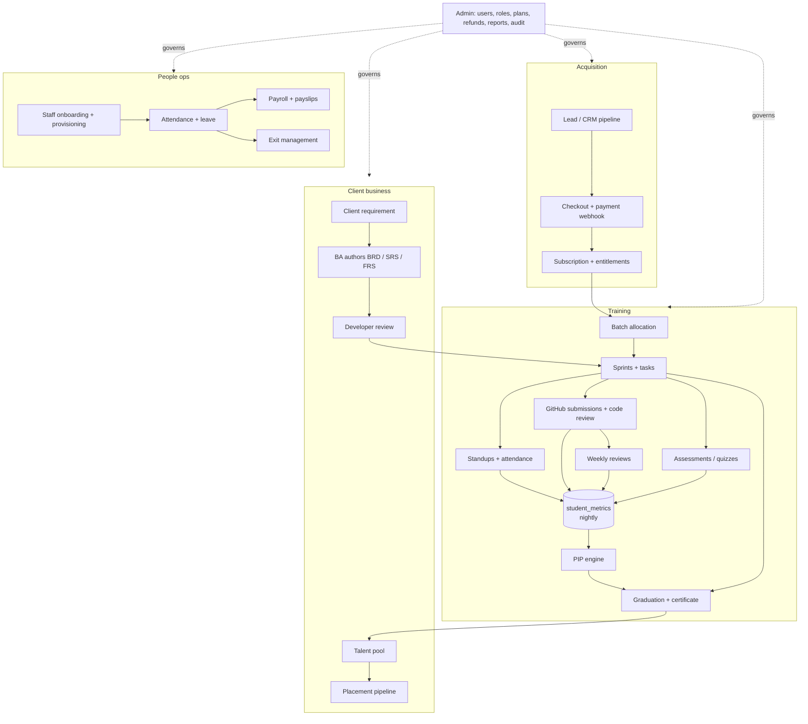

---

## 2. Lead → enrolment (Lead Generator / CRM)

`crm` module. `LeadStatus` is a forward pipeline; `LOST` is a terminal exit from any stage.

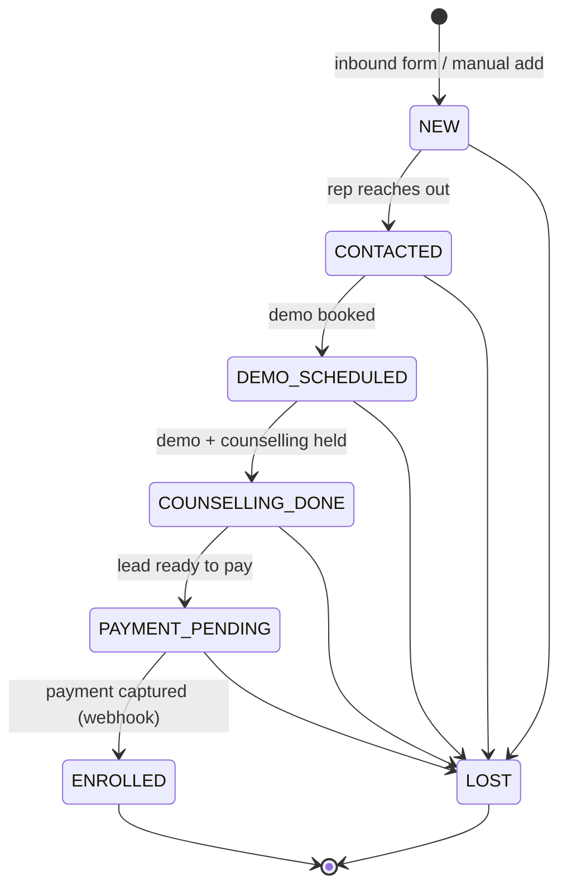

Targets & leaderboard track each rep's conversions. `ENROLLED` means a real subscription now
exists for that person (flow 3).

---

## 3. Sign-up → subscription → batch allocation

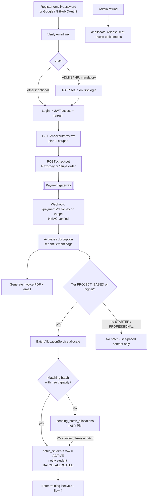

Webhooks are also reconciled by a nightly `WebhookReconciliationJob` in case a gateway
callback is missed.

---

## 4. Student training lifecycle

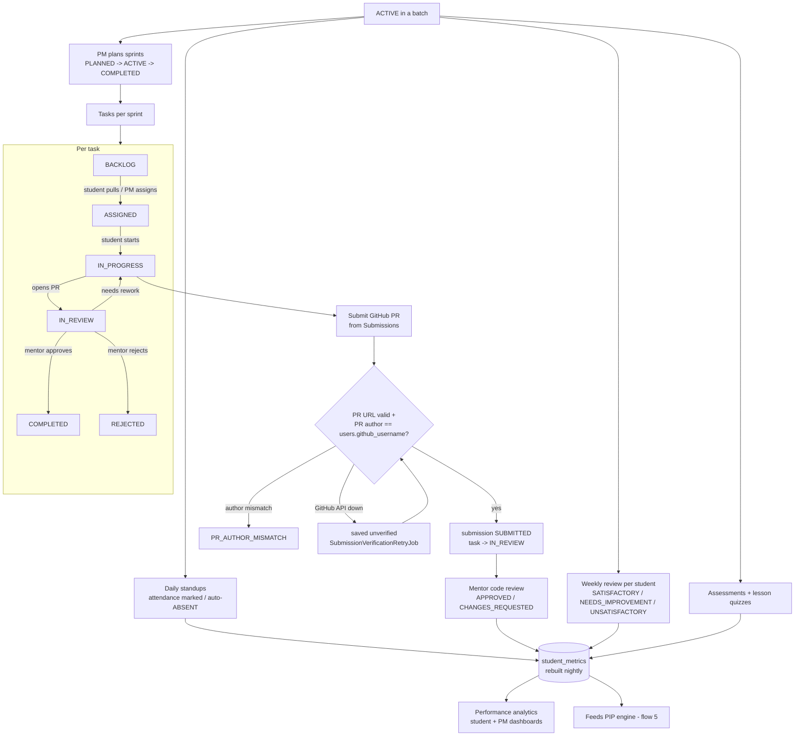

---

## 5. PIP (Performance Improvement Plan)

`pip` module. Nightly `PipEvaluationJob` runs four passes over `PipEvaluationService`.

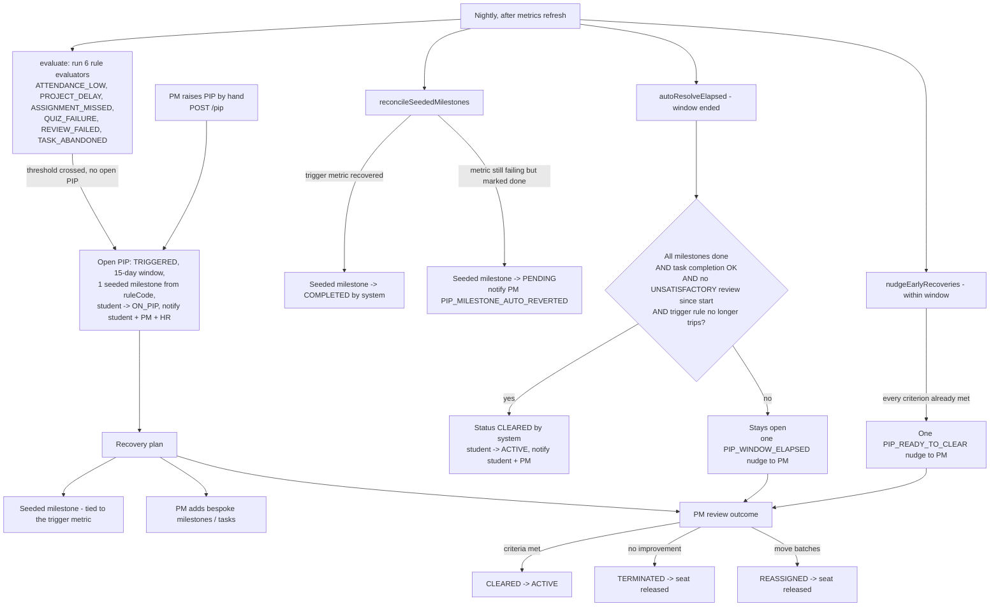

Clearance hard gates (manual review and auto-clear alike): task-completion percent >= target
AND no `UNSATISFACTORY` weekly review since the PIP started. Attendance / overdue tasks are
advisory for a human decision but the trigger metric must have recovered for the *automatic*
clear.

---

## 6. Graduation → certificate

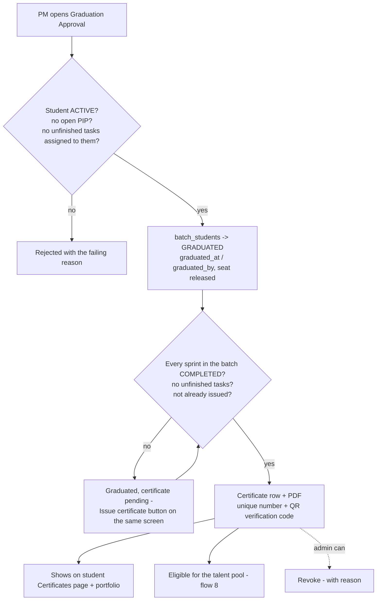

---

## 7. Client requirement → BA authoring → developer

`client` module. Multi-party sign-off before a spec is "approved".

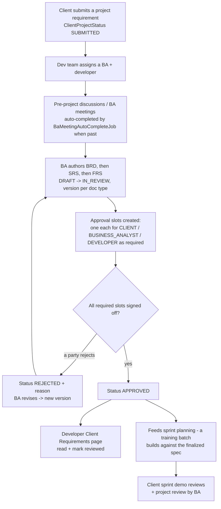

---

## 8. Placement pipeline (Talent pool → hired)

`placement` module. `PlacementStage` — driven by different actors at each step; `PLACED` and
`REJECTED` are terminal.

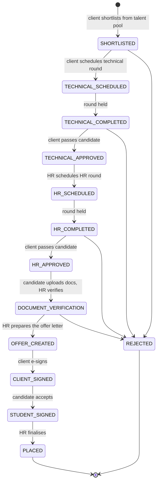

Each stage change notifies the relevant party (candidate / client / HR) with copy phrased for
that reader. HR's "Interview Outcome Record" keeps the technical + HR round history per
candidate.

---

## 9. HR / staff lifecycle

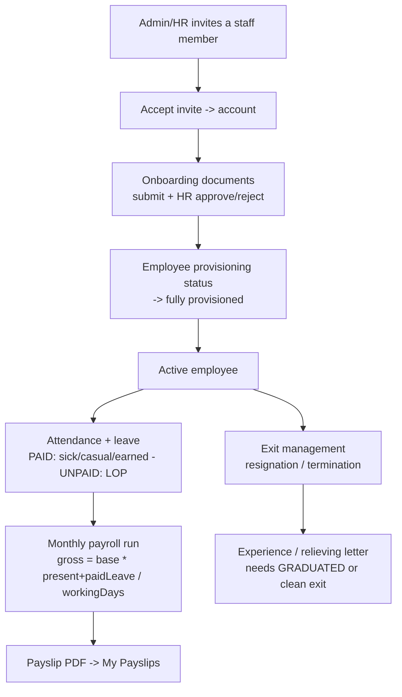

---

## 10. Nightly scheduled-job chain

Cron times are Asia/Kolkata. Each job records a `job_runs` row and holds a ShedLock.

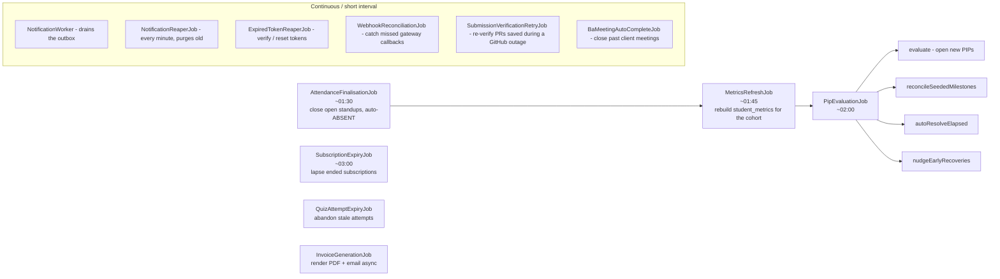

Dev-only on-demand triggers for the chain: `POST /api/v1/dev/jobs/{job}/run` — see
[testing-scheduled-jobs.md](testing-scheduled-jobs.md).

---

## 11. Auth & session (cross-cutting)

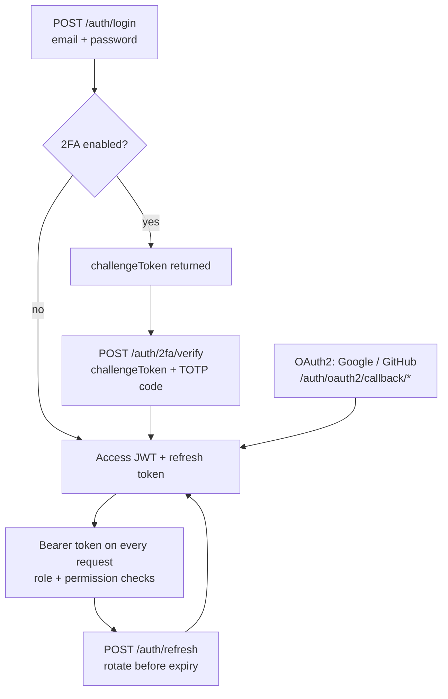
